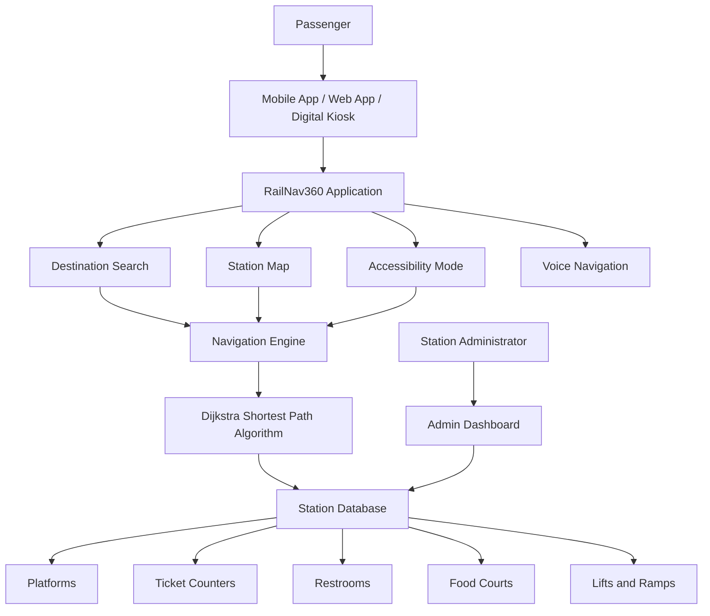
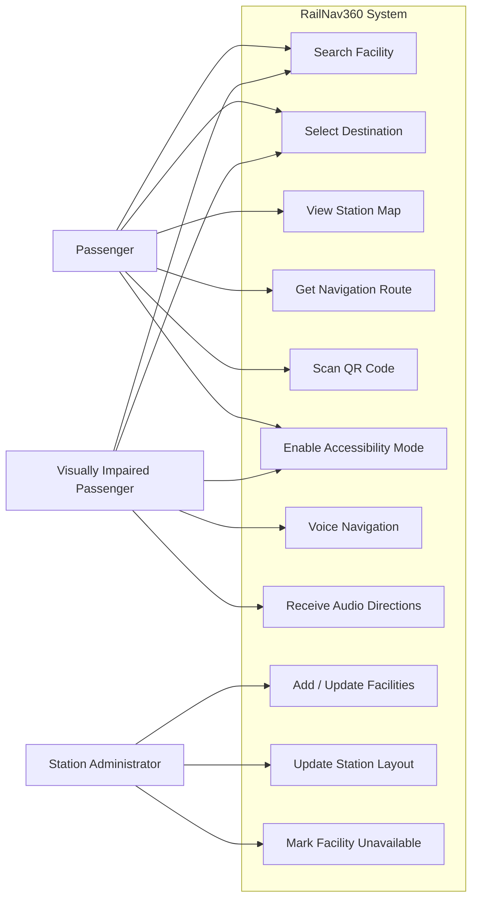

# RailNav360 – Smart Railway Station Navigation System

**Student Name:** Pooja U
**Register Number:** 25011745
**SIH Problem Statement:** 1710
**Problem Title:** Enhancing Navigation for Railway Station Facilities and Locations
**Problem Creator:** Ministry of Railways

---

## 1. Problem Statement

Railway stations contain many important facilities such as platforms, ticket counters, restrooms, waiting halls, food courts, lifts and escalators. In large or unfamiliar stations, passengers may find it difficult to locate these facilities quickly.

This problem becomes more challenging for elderly passengers, children and passengers with disabilities.

The proposed system provides a simple digital solution for navigating inside railway stations.

---

## 2. Proposed Solution

**RailNav360** is a smart indoor railway station navigation system that helps passengers find facilities and destinations inside a railway station.

The system provides:

* Interactive station maps
* Step-by-step indoor navigation
* Shortest-path navigation
* Accessibility-friendly routes
* Voice-guided directions
* QR-code based starting points
* Digital kiosk support
* Real-time facility updates

A passenger can select a destination such as a platform, restroom, ticket counter or food court. The system identifies the passenger's starting location and provides a suitable route.

For passengers using accessibility mode, the system can prefer routes containing lifts and ramps instead of stairs.

---

## 3. How the System Works

1. Passenger opens the RailNav360 application or station kiosk.
2. Passenger selects the required destination.
3. The system identifies the starting location using QR code or available location information.
4. The navigation engine calculates a suitable route.
5. The route is displayed on the station map.
6. Step-by-step directions are provided.
7. Voice guidance can be enabled for visually impaired passengers.
8. Administrators can update facility locations and temporary changes.

---

## 4. Key Features

### Interactive Station Map

Displays platforms, counters, restrooms, food courts, waiting areas, lifts and other facilities.

### Shortest Route

Calculates a suitable path between the passenger's current location and destination.

### Accessibility Mode

Provides routes that prefer lifts, ramps and accessible paths.

### Voice Navigation

Provides audio instructions to assist visually impaired passengers.

### QR Code Navigation

QR codes placed at important station locations can be scanned to set the passenger's starting point.

### Digital Kiosk

Passengers without smartphones can use touch-screen kiosks installed inside the station.

### Real-Time Updates

Station administrators can update facility availability, temporary closures and route changes.

### Admin Dashboard

Authorized staff can manage station maps and facility information.

---

## 5. Proposed System Architecture

The system consists of four major layers:

**User Layer → Application Layer → Navigation Layer → Data Layer**

The user interacts through a mobile application or digital kiosk.

The application communicates with the navigation engine, which calculates routes using station map data.

The database stores station layouts, facilities, accessibility information and updates.

### Proposed Solution Diagram

---

## 6. Use Cases

### Passenger

* Search for a facility
* Select destination
* View station map
* Get route
* Enable accessibility mode
* Listen to voice instructions
* Scan QR code

### Visually Impaired Passenger

* Select destination
* Enable voice navigation
* Receive audio directions

### Station Administrator

* Add facilities
* Update facility locations
* Mark facilities unavailable
* Update station map
* Manage navigation information
### Use Case Diagram

---

## 7. Technology Stack

### Frontend

* HTML
* CSS
* JavaScript
* React.js

### Backend

* Python
* Flask

### Database

* SQLite / MySQL

### Navigation

* Graph-based shortest path algorithm
* Dijkstra's Algorithm

### Other Technologies

* QR Code
* Web Speech API
* REST API

---

## 8. Dependencies

The proposed system may use the following dependencies:

* React.js
* Flask
* OpenCV
* NumPy
* NetworkX
* QR Code library
* Web Speech API

---

## 9. Advantages

* Reduces passenger confusion
* Saves navigation time
* Helps passengers locate facilities easily
* Supports passengers with disabilities
* Provides voice-based assistance
* Can be used through mobile devices and kiosks
* Allows station information to be updated

---

## 10. Future Scope

The system can be extended with:

* 3D station maps
* AI-based crowd prediction
* Integration with railway ticketing applications
* Emergency route guidance
* Multilingual voice navigation
* Live train and platform information
* Integration with smart-city infrastructure

---

## 11. Conclusion

RailNav360 provides a user-friendly solution for indoor railway station navigation. By combining interactive maps, shortest-path navigation, accessibility features, voice guidance and digital kiosks, the system can help passengers reach facilities and destinations more easily.

The system can be further developed and integrated with existing railway services to provide a complete smart railway station navigation experience.
